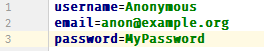
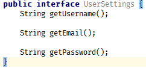
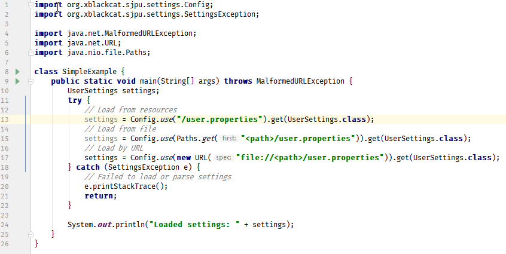
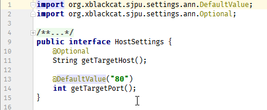
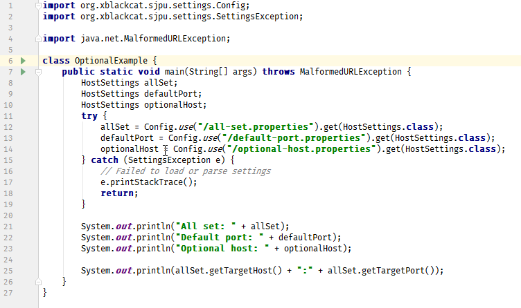

# [SJPU Settings Provider]

## Abstract

Settings Provider implements a simple binding from .properties files to Java objects.  
It support tracking file content changes with automatic thread-safe substitution of new data in runtime.

## Description
Data object is declared with interface with getters. During data parsing 

By default mapping of values from .properties file works as follows: camel-hump property name (for example `myFieldName`) associated with 
dot-separated property name (`my.field.name`). Accessing to data could be declared as getter (`getMyFieldName()`) as well as 
method named by field name (`myFieldName()`)

Default mapping could be overriding by `@PropertyName` annotation. 

## Examples

#### Simple usage:
1. A .properties file with data (**user.properties**)  

1. Declare interface for mapping data from .properties file **UserSettings.java**  

1. Load settings from Java code. Settings could be loaded from resource, file or by URL **SimpleExample.java**   
 
2. Output:  
```
Loaded settings: UserSettings [password (password) = "MyPassword"; email (email) = "anon@example.org"; username (username) = "Anonymous"]
```

#### Optional fields
By default all the properties are defined as mandatory. This means if there is no mapping from data object interface 
field to property whole object could not be constructed. There are two ways to deal with it:
1. Add `@Optional` annotation to a field - this will allow to return `null` value. (not applicable to primitives)
2. Add `@DefaultValue` annotation to a field - if mapping is not found a value from annotation will be used.

Here is an example to show both variants.

1. Data object interface (**HostSettings.java**):  

2. Properties files for test:
**all-set.properties**  
  
**default-port.properties**  
  
**optional-host.properties**   
  
3. Demonstration class **OptionalExample.java**
   
4. Outputs:
```
All set: HostSettings [targetPort (target.port) = "443"; targetHost (target.host) = "localhost"]  
Default port: HostSettings [targetPort (target.port) = "80"; targetHost (target.host) = "localhost"]  
Optional host: HostSettings [targetPort (target.port) = "443"; targetHost (target.host) = "null"]  
localhost:443
```

#### More examples
... will be shown later ...